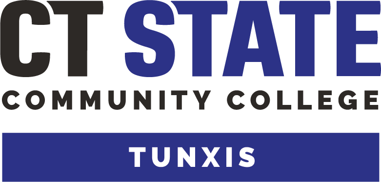

# Tunxis Code Archive

## Overview
This repository contains all the coursework, projects, and assignments completed while pursuing an associate's degree in computer science/mathematics and computer programming certification from Tunxis Community College.

## Introduction
This repository is a portfolio showcasing the skills and knowledge I've gained throughout my academic journey at Tunxis Community College.

## Relevant Courses
- Intro to Computers
- Programming Logic and Design with Visual Basic
- Advanced Visual Basic
- Object-Oriented Programming Using Java
- Advanced Java Programming
- Object-Oriented Programming Using C++
- Advanced C++ Programming
- Web Design and Development
- Database Design I
- System Analysis and Design
